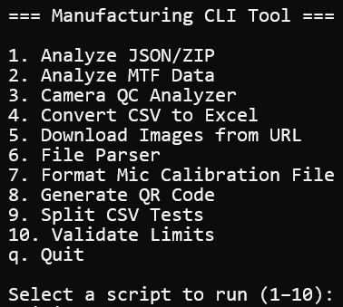

# Manufacturing CLI Tool

A simple command-line tool to assist with common manufacturing data tasks such as parsing test files, downloading images, and converting file formats.

---
### Run via Python

```powershell
python cli_tool.py
```
### Then 

- Choose a script from the menu
- Drag & drop or paste the required file path
- Done!

---

## Scripts Menu



---

## Available Scripts

### 1. Download Images from URL

- Downloads images listed in an Excel file (with URLs)
- Output folder: `downloaded_images/`

### 2. Analyze JSON/ZIP

- Analyzes PoE EELoad, PoE Network or Adapter Edac test data  for failed measurements
- Accepts `.json`, `.txt`, or zipped multiple files (`.zip`)
- Output folder: `extracted/`

### 3. Convert CSV to Excel

- Converts PoE EELoad `.csv` files into Excel format with custom headers
- Output folder: `extracted/`

### 4. Split CSV Tests

- Splits `.csv` files containing a multitude of tests
- Asks for number of tests to include in one split 
- Useful for uploading data to Factory Web
- Output folder: `extracted/`  

### 5. File Parser

- Parses raw PoE Network or Adapter Edac test files from `.zip` archives
- Output folder: `extracted/`

### 6. Validate Measurement Limits

- Validates raw test data files using limit profiles defined in `config.json`
- Can be used to validate:
  - Adapter EDAC data
  - PoE EELoad data
  - PoE Network data
- Limit configuration JSON files are stored inside folder: `limits/`
  - `edac_limits.json`
  - `eeload_limits.json`
  - `network_limits.json`
- Supports `.csv`, `.xlsx`, and `.txt` file formats with automatic parser selection
- Output folder: `extracted/` saved as `validation_results.txt`

### 7. Format Mic Calibration File

- Extracts Serial Number (SERNO) and Sensitivity Factor (Sens Factor) from the input `.txt` file
- Interpolates calibration values to a standard reference frequency list
- Handles invalid inputs gracefully (wrong file type or corrupted data)
- Output folder: `extracted/` saved as `SerialNumber_filtered.txt`

### 8. Analyze MTF Data

- Processes Test_MTF_FOCUS and Test_MTF_LCE sheets.
- Averages B#_H and B#_V values into B#_H_V.
- Applies styled formatting for clarity (colored cells for PASS/FAIL).
- Adds a fail summary (count + percentage) next to processed data.
- Output folder: `extracted/` saved as an output Excel file with `_processed` suffix.

---

## Requirements

- Windows
- Python 3.7+
- Packages (auto-installed)

## Internal Use Only

This tool is intended for internal factory and engineering team workflows only.
