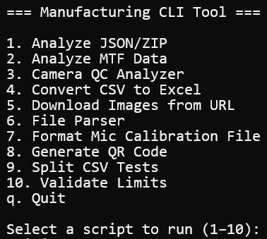
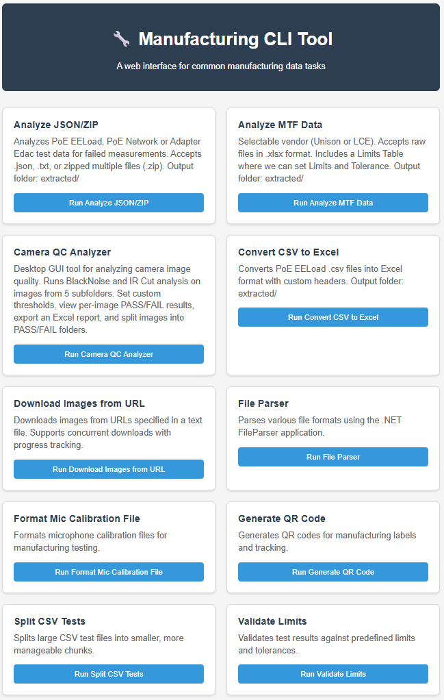

# Manufacturing CLI Tool

A simple command-line tool to assist with common manufacturing data tasks such as parsing test files, downloading images, and converting file formats.

---
### Install Requirements

```powershell
# Install requirements
pip install -r requirements.txt
```

---
### Run via PowerShell Scripts

**CLI Mode** — launches the interactive command-line menu:

```powershell
.\start-cli.ps1
```

**Web Mode** — starts the web server and opens the browser automatically:

```powershell
.\start-web.ps1
```

Then open your browser to `http://localhost:5000` if it does not open automatically.

**Update** — pulls the latest changes from GitHub:

```powershell
.\update.ps1
```

---
### Run via Python directly

```powershell
# CLI mode
python cli_tool.py

# Web mode (default port 5000)
python cli_tool.py --web

# Web mode (custom port)
python cli_tool.py --web --port 8080
```

---
### Then

- Choose a script from the menu
- Drag & drop or paste the required file path
- Done!

---

## Scripts Menu

### CLI Mode


### Web Mode


- **User-friendly interface**: Click buttons to run scripts instead of typing commands
- **Real-time feedback**: See success/error messages after running scripts
- **Responsive design**: Works on desktop and mobile devices
- **Background execution**: Scripts run asynchronously without blocking the interface
- **Same functionality**: All CLI features are available through the web interface

---

## Available Scripts

### 1. Analyze JSON/ZIP

- Analyzes PoE EELoad, PoE Network or Adapter Edac test data for failed measurements  
- Accepts `.json`, `.txt`, or zipped multiple files (`.zip`)  
- Output folder: `extracted/`

---

### 2. Analyze MTF Data

- Selectable vendor (Unison or LCE)   
- Accepts raw files in `.xlsx` format   
- Includes a Limits Table where we can set Limits and Tolerance   
- Output folder: `extracted/` saved as an output Excel file with `_processed` suffix  

---

### 3. Camera QC Analyzer

- Desktop GUI tool for analyzing camera image quality across BlackNoise and IR Cut tests
- Expects a root folder containing these subfolders:
  - `BlackNoisePicUrl/`
  - `IrCutOnFirstPicUrl/`
  - `IrCutOnSecondPicUrl/`
  - `IrCutOffFirstPicUrl/`
  - `IrCutOffSecondPicUrl/`
- Set custom thresholds for BlackNoise and IR Cut via the UI
- **Metrics:**
  - **BlackNoise**: Max-Channel Mean — mean of `max(R,G,B)` per pixel; value < threshold → PASS
  - **IR Cut Off**: R-G difference should be negative (normal scene) → R-G < threshold → PASS
  - **IR Cut On**: R-G difference should be positive (pinkish/IR) → R-G ≥ threshold → PASS
- Exports an Excel report with per-image results and PASS/FAIL summary
- Splits images into PASS/FAIL folders automatically
- Run standalone (no CLI required):

```powershell
python scripts/camera_qc_analyzer.py
```

---

### 4. CSV Convert to Excel

- Converts PoE EELoad `.csv` files into Excel format with custom headers  
- Output folder: `extracted/`

---

### 5. CSV Split Tests

- Splits `.csv` files containing a multitude of tests  
- Asks for number of tests to include in one split  
- Useful for uploading data to Factory Web  
- Output folder: `extracted/`  

---

### 6. Download Images from URL

- Downloads images listed in an Excel file (with URLs)  
- Output folder: `downloaded_images/`

---

### 7. File Parser

- Parses raw PoE Network or Adapter Edac test files from `.zip` archives  
- Output folder: `extracted/`

---

### 8. Format Mic Calibration File

- Extracts Serial Number (SERNO) and Sensitivity Factor (Sens Factor) from the input `.txt` file  
- Interpolates calibration values to a standard reference frequency list  
- Handles invalid inputs gracefully (wrong file type or corrupted data)  
- Output folder: `extracted/` saved as `SerialNumber_filtered.txt`

---

### 9. QR Code Generator

- Generates QR codes from text or URLs  
- Takes user input and creates a PNG QR code image  
- Output folder: `extracted/`  

---

### 10. Validate Measurement Limits

- Validates raw test data files using limit profiles defined in `config.json`  
- Can be used to validate:
  - Adapter EDAC data  
  - PoE EELoad data  
  - PoE Network data  
- Limit configuration JSON files are stored inside folder: `limits/`  
  - `edac_limits.json`  
  - `eeload_limits.json`  
  - `network_limits.json`  
- Supports `.csv`, `.xlsx`, and `.txt` file formats with automatic parser selection  
- Output folder: `extracted/` saved as `validation_results.txt`

---

## Requirements

- Windows
- Python 3.7+
- Packages (auto-installed)

## Internal Use Only

This tool is intended for internal factory and engineering team workflows only.
